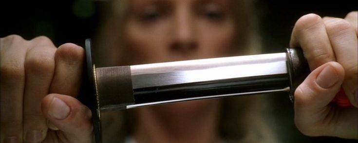

<h1 align="center">𝗝𝗢𝗔𝗢 𝗩𝗜𝗖𝗧𝗢𝗥</h1>

<h2 align="center">
  
    Front-End Developer • Full Stack in progress
  
</h2>

  

  
  
  

  

# 🗡️ ABOUT

I'm 16 years old, from Goiás, Brazil, and currently building my career in technology from scratch.

I currently work as an administrative assistant at RENAPSI while studying software development through self-taught and intensive training.

My focus is to become a Full Stack developer capable of building complete products,  from modern interfaces to intelligent and scalable systems.

  

## ⚔️ WEAPONS

  

  

  

# 📊 GITHUB ANALYTICS

  

  

  

# 🎯 FEATURED PROJECTS

| Projeto                                                                | Descrição                                       | Tech                    |
| ---------------------------------------------------------------------- | ----------------------------------------------- | ----------------------- |
| [🧭 Colalá](https://github.com/joaoamorinz0/colala)     | Aplicativo de descoberta de lugares e experiências | React • Typescript • JavaScript • Next.JS |
| [🗺️ Buscador de CEP](https://github.com/joaoamorinz0/buscador-de-cep) | Sistema de busca de CEP utilizando API          | HTML • CSS • JavaScript |

---

# 📬 CONTACT

  

  

  

---

  
    Forged by focus, coffee and many musics.
  

  
    inspired by Quentin Tarantino cinematography
  

